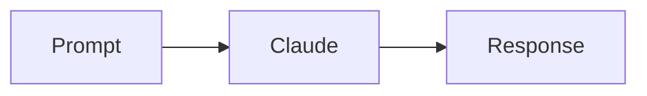

# jurnal.dev

Personal portfolio + journal platform untuk **@jurnal.dev** — Swiss/Helvetica minimal aesthetic dengan dark/light mode, EN/ID language toggle, dan headless CMS integration.

Built with Next.js 15 (App Router), TypeScript, Tailwind CSS, Geist font, dan Strapi v5.

---

## Quick start

```bash
# 1. Install dependencies
npm install

# 2. Copy env template (optional — works without Strapi using mock data)
cp .env.example .env.local

# 3. Run dev server
npm run dev

# Open http://localhost:3000
```

**Without Strapi**: App works out of the box with mock data (5 sample articles pre-loaded).
**With Strapi**: Follow [STRAPI_SETUP.md](./STRAPI_SETUP.md) to setup the CMS.

---

## Pages

| Route            | Description                                               |
| ---------------- | --------------------------------------------------------- |
| `/`              | Landing page (hero, about, journal preview, lab, connect) |
| `/jurnal`        | All journal entries (grid, filterable by locale)          |
| `/jurnal/[slug]` | Individual article with TOC, related posts, share buttons |

---

## Tech stack

- **Framework**: Next.js 15 (App Router, React 19)
- **Language**: TypeScript (strict)
- **Styling**: Tailwind CSS + CSS variables (theme-aware)
- **Fonts**: Geist Sans + Geist Mono
- **Icons**: Lucide React
- **CMS**: Strapi v5 (headless, with i18n plugin)
- **Markdown**: `react-markdown` + `remark-gfm` + `rehype-slug`
- **Syntax highlighting**: Shiki (server-side, zero runtime cost)
- **Diagrams**: Mermaid (client-side)
- **Deploy**: Vercel (zero-config)

---

## Project structure

```
jurnal-dev/
├── src/
│   ├── app/
│   │   ├── layout.tsx              # Root layout, fonts, providers, SEO
│   │   ├── page.tsx                # Landing page
│   │   ├── globals.css             # Theme variables, global styles
│   │   ├── jurnal/
│   │   │   ├── page.tsx            # /jurnal list
│   │   │   └── [slug]/
│   │   │       ├── page.tsx        # /jurnal/[slug] server component
│   │   │       ├── article-view.tsx
│   │   │       └── locale-gate.tsx
│   │   └── api/
│   │       └── articles/
│   │           └── route.ts        # /api/articles endpoint
│   ├── components/
│   │   ├── page-header.tsx         # Shared nav + toggles
│   │   ├── journal-section.tsx     # Landing page journal preview
│   │   ├── avatar.tsx, code-snippet.tsx, social-links.tsx, etc
│   │   └── article/
│   │       ├── article-body.tsx    # Markdown → React renderer
│   │       ├── article-card.tsx    # Grid card
│   │       ├── article-header.tsx
│   │       ├── author-card.tsx
│   │       ├── callout.tsx         # :::info/warning/tip/success
│   │       ├── code-block.tsx      # With copy button
│   │       ├── copy-button.tsx
│   │       ├── instagram-embed.tsx
│   │       ├── mermaid.tsx         # Client-side diagrams
│   │       ├── related-articles.tsx
│   │       ├── share-buttons.tsx
│   │       └── toc.tsx             # Scroll-spy TOC
│   ├── contexts/
│   │   ├── lang-context.tsx
│   │   └── theme-context.tsx
│   └── lib/
│       ├── article-utils.ts        # Reading time, date, TOC extraction
│       ├── content.ts              # Landing page copy
│       ├── theme-script.ts
│       └── strapi/
│           ├── index.ts            # Smart fetcher (Strapi → mock fallback)
│           ├── client.ts           # REST API client
│           ├── mock.ts             # Dev mock data
│           └── types.ts            # TypeScript types
├── STRAPI_SETUP.md                 # CMS setup guide
├── .env.example
└── README.md
```

---

## Article system

The journal supports **rich Markdown content** via Strapi CMS (or mock data for local dev).

### Supported content elements

| Element       | Markdown              | Notes                                                    |
| ------------- | --------------------- | -------------------------------------------------------- |
| Headings      | `## H2`, `### H3`     | Auto-generates TOC, supports anchor links                |
| Code blocks   | ` ```lang `           | Server-side highlighted with Shiki, copy button included |
| Inline code   | `` `code` ``          |                                                          |
| Images        | ``         | Renders as `<figure>` with caption from alt text         |
| Tables        | GFM tables            | Styled with Swiss aesthetic                              |
| Blockquotes   | `> quote`             |                                                          |
| Lists         | `- item` / `1. item`  |                                                          |
| Links         | `[text](url)`         | External links auto-open in new tab                      |
| **Callouts**  | `:::info ... :::`     | Custom: `info`, `warning`, `tip`, `success`              |
| **Mermaid**   | ` ```mermaid `        | Client-side rendered, theme-aware                        |
| **Instagram** | Paste URL on own line | Auto-detected & embedded                                 |

### Example article body

````markdown
## The beginning

Gw mulai serius belajar AI karena...

:::info
Quick note: gunakan Python 3.10+ untuk compatibility terbaik.
:::

```typescript
const client = new Anthropic()
const message = await client.messages.create({
  model: "claude-opus-4-7",
  messages: [{ role: "user", content: "Hello!" }],
})
```



https://instagram.com/reel/ABC123/

:::warning
Jangan commit `.env` file ke git!
:::
````

---

## Customization guide

### 1. Update personal info

Edit **`src/lib/content.ts`**:

- `role`, `tagline`, `about`, `currentlyValue`, `stackValue` — untuk kedua bahasa (`en` & `id`)
- `socials` array — ganti URL kalau mau tambah/remove platform

### 2. Update metadata (SEO)

Edit **`src/app/layout.tsx`** bagian `metadata`:

- `metadataBase` — ubah ke domain production lu (default: `https://jurnal.dev`)
- `title`, `description`, `keywords`
- `openGraph.images` — add OG image URL (recommended: `/og.png` di public folder, 1200×630px)
- `twitter.images` — Twitter card image

### 3. Ganti avatar

Opsi A — pake foto asli:

1. Drop foto ke `public/avatar.jpg`
2. Edit **`src/components/avatar.tsx`**, ganti SVG dengan:
   ```tsx
   import Image from "next/image"
   export function Avatar() {
     return (
       <div
         style={{
           width: 72,
           height: 72,
           borderRadius: "50%",
           overflow: "hidden",
         }}
       >
         <Image src="/avatar.jpg" alt="Fahmi" width={72} height={72} />
       </div>
     )
   }
   ```

Opsi B — edit SVG: langsung modify path/circle di `avatar.tsx`.

### 4. Ganti code snippet

Edit **`src/components/code-snippet.tsx`** — semua content-nya inline di JSX. Ganti ke snippet favorite lu (agentic workflow, MCP tool, whatever). Filename di header juga bisa diganti.

### 5. Tambah real journal entries

Sekarang pake empty state. Untuk upgrade ke real entries:

1. Buat data source (bisa simple array di `src/lib/journal.ts`, atau MDX, atau fetch dari Strapi/Notion)
2. Edit **`src/components/journal-section.tsx`** — replace skeleton cards dengan real entry cards
3. Consider add `src/app/jurnal/[slug]/page.tsx` untuk individual post pages

Example data shape:

```ts
export const entries = [
  {
    slug: "rag-basics",
    title: "RAG, tapi beneran",
    excerpt: "Ngoprek retrieval augmented generation...",
    date: "2026-05-01",
    cover: "/covers/rag.jpg", // atau gradient string
  },
]
```

### 6. Color palette

Edit **`src/app/globals.css`** — semua color dikontrol via CSS variables:

- `:root { ... }` untuk light mode
- `.dark { ... }` untuk dark mode

Change `--bg`, `--text`, `--border`, etc., dan sisanya auto-propagate.

### 7. Fonts

Default pake Geist Sans + Mono. Kalau mau ganti:

1. Edit **`src/app/layout.tsx`** — ganti `GeistSans`/`GeistMono` import dari `next/font/google` atau `next/font/local`
2. Update CSS variable name di `globals.css` dan `tailwind.config.mjs` kalau perlu

---

## Deploy

### Vercel (recommended)

```bash
# Install Vercel CLI (optional)
npm i -g vercel

# Deploy
vercel

# Atau push ke GitHub dan import di vercel.com — zero config
```

Setelah deploy:

1. Set custom domain `jurnal.dev` di Vercel project settings
2. Update `metadataBase` di `layout.tsx` kalau domain beda

### Self-hosted (Docker + homelab)

```dockerfile
# Dockerfile
FROM node:20-alpine AS builder
WORKDIR /app
COPY package*.json ./
RUN npm ci
COPY . .
RUN npm run build

FROM node:20-alpine
WORKDIR /app
COPY --from=builder /app/.next ./.next
COPY --from=builder /app/public ./public
COPY --from=builder /app/package*.json ./
COPY --from=builder /app/node_modules ./node_modules
EXPOSE 3000
CMD ["npm", "start"]
```

Pair dengan Cloudflare Tunnel atau Traefik reverse proxy.

### Static export (optional)

Kalau landing page ini fully static (ga ada dynamic data), bisa export ke plain HTML:

```js
// next.config.mjs
export default { output: "export" }
```

```bash
npm run build
# Output di /out — deploy ke Cloudflare Pages, GitHub Pages, Netlify, dll
```

---

## Features included

- ✅ **Theme system**: Light / Dark / System (follows `prefers-color-scheme`)
- ✅ **Anti-flash**: Inline script sets theme before hydration
- ✅ **Theme persistence**: Saves preference to localStorage
- ✅ **i18n**: EN / ID toggle with browser locale auto-detection
- ✅ **SEO**: Open Graph, Twitter cards, proper metadata
- ✅ **Responsive**: Works on mobile, tablet, desktop
- ✅ **A11y**: Proper ARIA labels, semantic HTML, keyboard nav
- ✅ **Type-safe**: Full TypeScript strict mode
- ✅ **Zero CLS**: No layout shift during theme/font loading

---

## Roadmap ideas

Kalau lu mau grow landing page ini:

- [ ] Add `/jurnal` route untuk list semua journal entries
- [ ] Add `/jurnal/[slug]` untuk individual posts (MDX support)
- [ ] RSS feed (`/rss.xml`) untuk subscribers
- [ ] Integrate dengan Instagram Graph API untuk pull reels latest
- [ ] Newsletter signup (Buttondown / ConvertKit)
- [ ] View counter per jurnal (pake Vercel KV atau Turso)
- [ ] Search dengan Cmd+K (pake cmdk library)
- [ ] Guestbook / comments (pake GitHub Discussions API)

---

## License

MIT — feel free to fork & adapt.

---

Made by Fahmi Hidayat · [@jurnal.dev](https://instagram.com/jurnal.dev)
