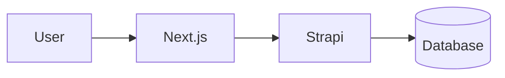

# Strapi CMS Setup Guide

Panduan lengkap buat setup Strapi v5 sebagai headless CMS untuk jurnal.dev.

---

## 1. Initial Strapi setup

```bash
# Create new Strapi project
npx create-strapi-app@latest jurnal-cms --quickstart

# Starts at http://localhost:1337
# First run will open admin registration page — create your admin account
```

Quickstart uses SQLite by default. Untuk production, recommended pake PostgreSQL/MySQL.

---

## 2. Enable i18n

1. Admin panel → **Settings** → **Internationalization**
2. Add locales:
   - `en` (English — should be default)
   - `id` (Indonesian)
3. Set `en` sebagai default locale

---

## 3. Content Types

Create these Content Types via **Content-Type Builder**:

### A. Tag (Collection Type)

| Field  | Type         | Required | Notes              |
| ------ | ------------ | -------- | ------------------ |
| `name` | Text (Short) | ✅       | Tag display name   |
| `slug` | UID          | ✅       | Attached to `name` |

**Internationalization**: Disabled (tags shared across locales).

---

### B. Author (Collection Type)

| Field     | Type           | Required | Notes                                      |
| --------- | -------------- | -------- | ------------------------------------------ |
| `name`    | Text (Short)   | ✅       |                                            |
| `bio`     | Text (Long)    |          | Short bio                                  |
| `avatar`  | Media (single) |          | Profile pic                                |
| `socials` | JSON           |          | `{ instagram, twitter, github, linkedin }` |

**Internationalization**: Disabled.

---

### C. Article (Collection Type)

| Field         | Type                            | Required | Localized | Notes                |
| ------------- | ------------------------------- | -------- | --------- | -------------------- |
| `title`       | Text (Short)                    | ✅       | ✅        |                      |
| `slug`        | UID                             | ✅       | ✅        | Attached to `title`  |
| `excerpt`     | Text (Long)                     | ✅       | ✅        | Max ~200 chars       |
| `body`        | Rich text (Markdown)            | ✅       | ✅        | Main content         |
| `cover`       | Media (single)                  |          |           | Cover image, shared  |
| `entryNumber` | Number (Integer)                |          |           | #001, #002, etc      |
| `featured`    | Boolean                         |          |           | Show on landing page |
| `tags`        | Relation → Tag (many-to-many)   |          |           |                      |
| `author`      | Relation → Author (many-to-one) |          |           |                      |

**Internationalization**: Enable it. Fields marked ✅ "Localized" can have different values per locale. `cover`, `entryNumber`, `featured`, `tags`, `author` should be **shared** across locales (not localized).

**Advanced settings**:

- Set `slug` as "Unique"
- Add `publishedAt` if not auto-added

---

## 4. Permissions

**Settings → Users & Permissions → Roles → Public**:

Enable these actions:

- **Article**: `find`, `findOne`
- **Tag**: `find`, `findOne`
- **Author**: `find`, `findOne`

If you want to keep the API token-only:

1. **Settings → API Tokens → Create**
2. Name: `nextjs-frontend`
3. Token type: `Read-only`
4. Save and copy the token → paste into `.env` as `STRAPI_API_TOKEN`

---

## 5. Markdown custom syntax (optional)

Your article body can use standard Markdown plus these custom blocks that your Next.js frontend renders specially:

### Callouts

```markdown
:::info
This is an info callout.
:::

:::warning
Be careful here.
:::

:::tip
Pro tip inside.
:::

:::success
All good!
:::
```

### Instagram embeds

Just paste the URL on its own line:

```markdown
https://instagram.com/reel/ABC123xyz/
```

### Mermaid diagrams

Use a fenced code block with `mermaid` language:

````markdown

````

---

## 6. Sample API calls

Test the API works:

```bash
# List English articles
curl "http://localhost:1337/api/articles?locale=en&populate=*"

# Single article by slug
curl "http://localhost:1337/api/articles?filters[slug][\$eq]=my-first-post&locale=id&populate=*"

# With auth token (production)
curl -H "Authorization: Bearer YOUR_TOKEN" \
  "https://cms.jurnal.dev/api/articles?locale=en&populate=*"
```

---

## 7. Connect to Next.js

In your Next.js project root, create `.env.local`:

```bash
NEXT_PUBLIC_STRAPI_URL=http://localhost:1337
STRAPI_API_TOKEN=your-token-here
```

Restart Next.js dev server. Done — now `/jurnal` reads from Strapi.

---

## 8. Recommended production setup

- **Hosting**: Railway.app, Render.com, or self-host via Docker
- **Database**: Managed PostgreSQL (Railway, Neon, Supabase)
- **Media storage**: AWS S3 / Cloudflare R2 via `@strapi/provider-upload-aws-s3` plugin
- **CDN**: Cloudflare in front of Strapi
- **Domain**: `cms.jurnal.dev`
- **Revalidation**: Setup webhook in Strapi → Next.js API route to trigger `revalidateTag('articles')` on publish

---

## 9. Writing your first article

1. Admin → **Content Manager → Article → Create new entry**
2. Set locale to `en` (top-right dropdown)
3. Fill in: title, slug (auto), excerpt, body (Markdown), cover image, tags, author
4. **Save** → **Publish**
5. Switch locale to `id` → Create localization (same entry, translated)
6. Publish both
7. Visit `http://localhost:3000/jurnal` — should see your new entry

---

## Troubleshooting

**Articles not showing up?**

- Check the article status is **Published** (not Draft)
- Check Public role has `find`/`findOne` permission on Article
- Check `NEXT_PUBLIC_STRAPI_URL` in `.env.local` matches Strapi URL
- Restart Next.js after changing env vars

**Images not loading?**

- Strapi returns relative URLs (`/uploads/...`). The frontend's `strapiMediaUrl()` prepends `STRAPI_URL`. Ensure it's configured.
- For production, configure S3/R2 upload provider so images get absolute URLs

**i18n toggle broken?**

- Verify locale codes match exactly: `en` and `id` (lowercase, 2 chars)
- Verify article has been **localized** (not just duplicated) — Strapi has a dedicated "Add locale" action
